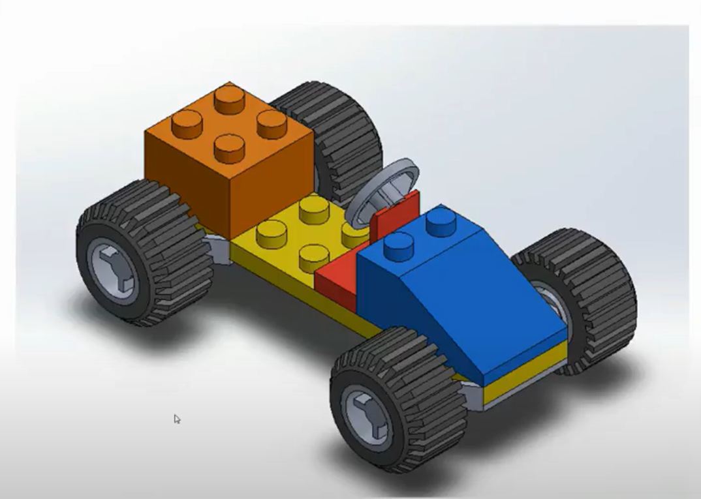

<h1>Aula 8</h1>

Esta clase consiste en realizar un ensamble en SolidWorks teniendo en cuenta diferentes relaciones de posición.

<h2>Ensamble en SolidWorks</h2>

Los ensambles son realizados partiendo de tener las piezas correspondientes listas para así comenzarlas a unir a través de relaciones de posición.

<h3>Ejercicio 1</h3>

