<h1>Aula 2</h1>

Esta clase consiste en comprender los conceptos básicos del curso, tales como: boceto, croquis, plano, normas, formatos, rótulos, letra técnica y escalas.

<h2>INTRODUCCIÓN A EXPRESIÓN GRÁFICA</h2>

La expresión gráfica permite representar objetos detallando las características de los mismos (forma, tamaño, grosores, entre otros). Algunos tipos de dibujos más utilizados son Boceto, Croquis y Plano.

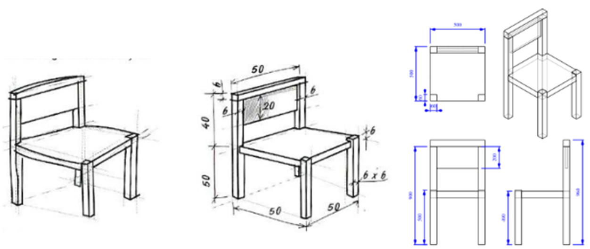

Fuente: http://tec.amordedioscadiz.org/tec2/tipos_de_dibujos.html 

<h3>Normas</h3>

Las normas son el conjunto de reglas como requisito indispensable para el proceso (diseño, desarrollo, fabricación y calidad) de un producto y/o servicio; las cuales se establecen en un documento aprobado por un organismo de Normalización, con el fin de estandarizar cada detalle del proceso.

Las normas son identificadas generalmente por siglas del Organismo que lo apruebe: 

<ul>
	<li>ISO: International Organization for Standarization</li>
    <li>EN: Norma europea Organismo de Normalización Europeo: CEN, CENELEC, ETSI</li>
    <li>UNE: Una norma española de AENOR</li>
    <li>NTC: Norma Técnica Colombiana</li>
    <li>ICONTEC: Instituto Colombiano de Normas Técnicas y Certificación</li>
</ul>

Fuente: https://image3.slideserve.com/5535840/normas-t-cnicas-colombianas-ntc1-l.jpg

<h3>Formatos (ISO 5457)</h3>

Los formatos definen el tamaño del papel y tienen diferentes series (A, B o C) según la norma ISO. La principal justificación de los diferentes formatos es desperdiciar el mínimo espacio posible.

Fuente: https://mvblog.me/wp-content/uploads/2012/04/formatoserieA.jpg

El rotulo se debe colocar en la posición inferior derecha del formato, teniendo en cuenta que la dirección de este debe ser acorde a la del dibujo.

Fuente: https://iessantabarbara.es/departamentos/fisica/tecnologia/webquest/cotas/Refuerzo/dibujos/nor5.GIF

Fuente: http://dibujotecnico.ramondelaguila.com/normalizacion/casillero_archivos/image001.png

<h3>Rótulo (NTC 1914)</h3>

El rotulo debe contener uno o más rectángulos adyacentes, los cuales pueden estar subdivididos en cajas para la inserción de información específica. La información debe agruparse en:

<ul>
	<li>Zona de identificación: Contiene el número de registro o identificación (a), el titulo del dibujo (b) y el nombre del propietario legal del dibujo (c)</li>
    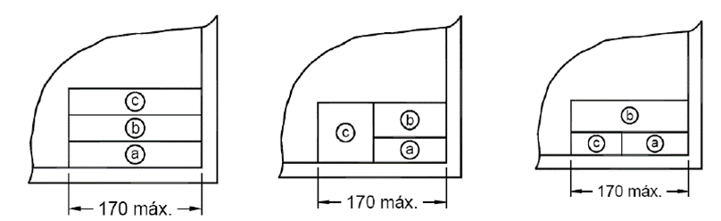
    <li>Zona de información adicional:</li>
        1. Ítems indicativos: Para evitar errores de interpretación del método de presentación. Se debe indicar el método de proyección, la escala principal, la unidad de dimensión lineal.
        2. Ítems técnicos: Incluye la textura de las superficies, tolerancias geométricas, valores de tolerancias generales y otras normas de este campo.
        3. Ítems administrativos: Tamaño de papel, fecha de primera emisión del dibujo, símbolo de revisión, fecha y otra información administrativa.
</ul>

<h3>Plegado de formatos (NTC 1687)</h3>

El plegado de formatos consiste en doblar por secciones hasta igualar el tamaño de los formatos a archivar en bolsa o en cuaderno; comúnmente es hasta A4. El recuadro del dibujo es a=10mm para formatos A0, A1 y A2, y a=5mm para formatos A3, A4 y A5

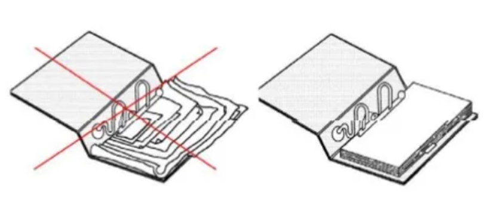

Fuente: https://pt.slideshare.net/profesoredgard/normas-icontec-para-dibujo-tecnico

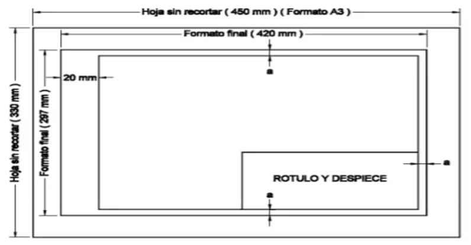

Fuente: https://pt.slideshare.net/profesoredgard/normas-icontec-para-dibujo-tecnico

<h4>Plegado modular (archivar en bolsa)</h4>

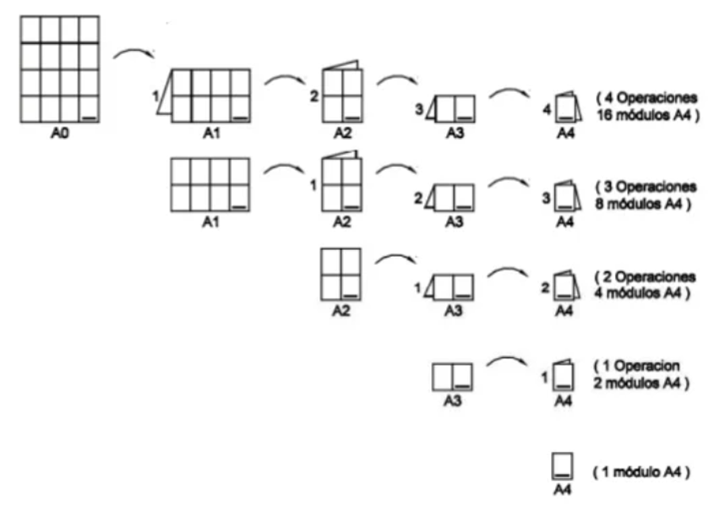

Fuente: https://pt.slideshare.net/profesoredgard/normas-icontec-para-dibujo-tecnico

<h4>Encuadernación (archivar en carpeta)</h4>

<h5>Formato A0</h5>

- Formato A0 (horizontal)

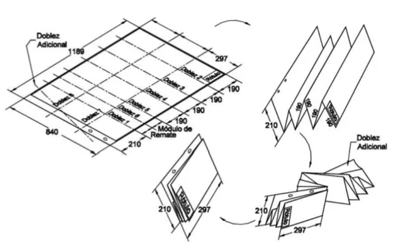

Fuente: https://pt.slideshare.net/profesoredgard/normas-icontec-para-dibujo-tecnico

- Formato A0 (vertical)

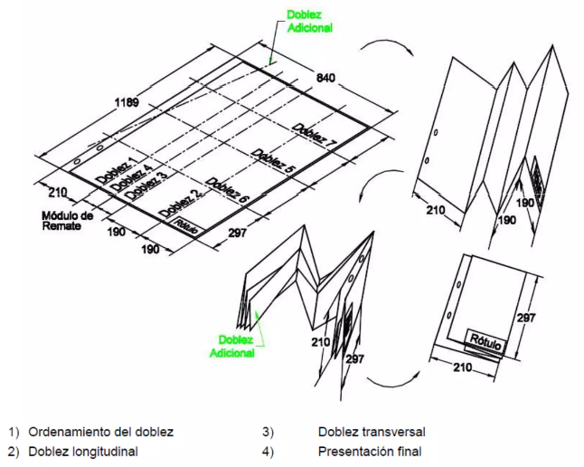

Fuente: https://pt.slideshare.net/profesoredgard/normas-icontec-para-dibujo-tecnico

<h5>Formato A1</h5>

- Formato A1 (horizontal)

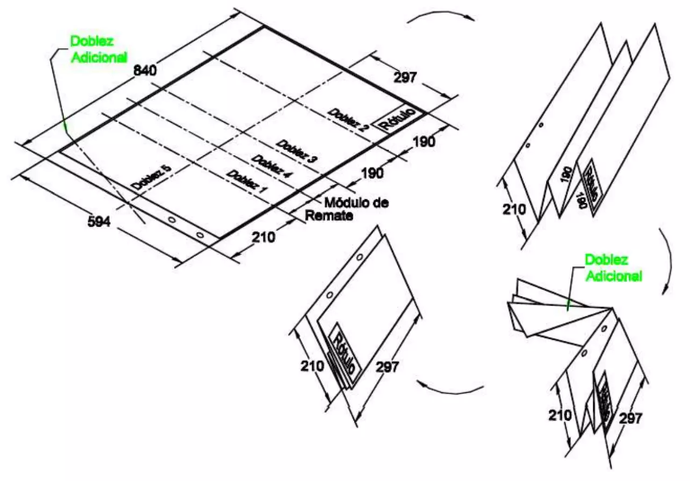

Fuente: https://pt.slideshare.net/profesoredgard/normas-icontec-para-dibujo-tecnico

- Formato A1 (vertical)

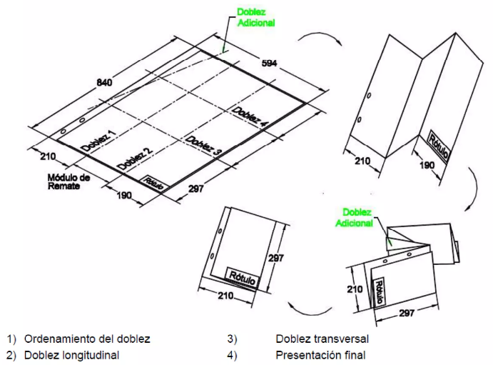

Fuente: https://pt.slideshare.net/profesoredgard/normas-icontec-para-dibujo-tecnico

<h5>Formato A2</h5>

- Formato A2 (horizontal)

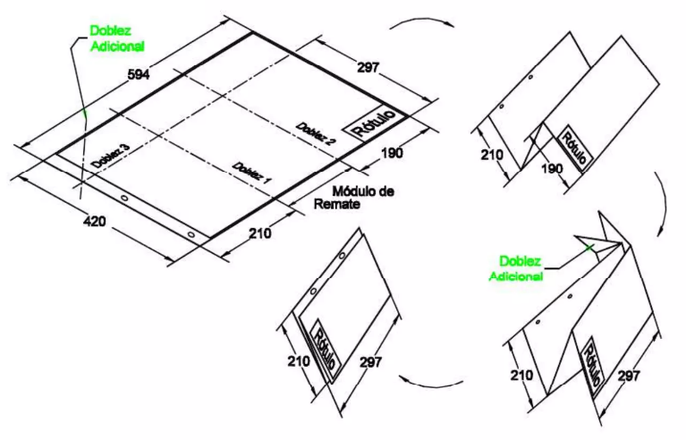

Fuente: https://pt.slideshare.net/profesoredgard/normas-icontec-para-dibujo-tecnico

- Formato A2 (vertical)

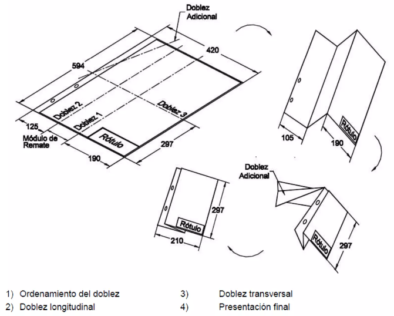

Fuente: https://pt.slideshare.net/profesoredgard/normas-icontec-para-dibujo-tecnico

<h5>Formato A3</h5>

- Formato A3 (horizontal)

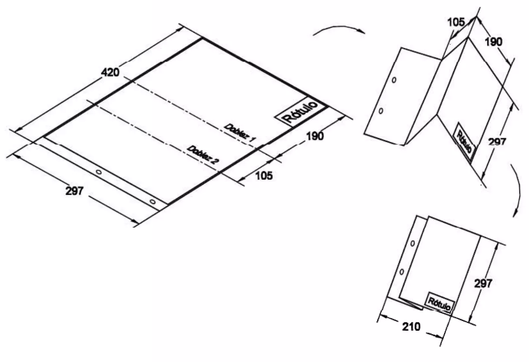

Fuente: https://pt.slideshare.net/profesoredgard/normas-icontec-para-dibujo-tecnico

- Formato A3 (vertical)

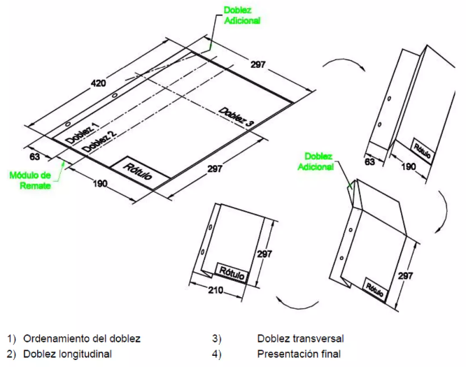

Fuente: https://pt.slideshare.net/profesoredgard/normas-icontec-para-dibujo-tecnico

<h3>Letra técnica (NTC 2527 Y NTC 2528)</h3>

La letra técnica es una caligrafía técnica que realza la calidad (precisión, claridad y limpieza) del trabajo en general, siendo que las letras y los números deben trazarse de acuerdo con las técnicas.

Toda escritura normalizada debe ser:

<ul>
    <li>Legible (claridad y lectura rápida)</li>
    <li>Homogénea (caracteres reglados en forma, tamaño, etc.)</li>
    <li>Reproducible  (apta para producirse por diferentes medios)</li>
    <li>Deben distinguirse con claridad todos los caracteres.</li>
    <li>La altura en proporción con papel y dibujo.</li>
    <li>Mayúsculas para titulares y encabezamientos.</li>
</ul>

Fuente: https://3.bp.blogspot.com/-rcbVMxgvgs4/UXGjuFMDAdI/AAAAAAAAAI0/kHz2ZFHj8t4/s1600/ima1.jpg

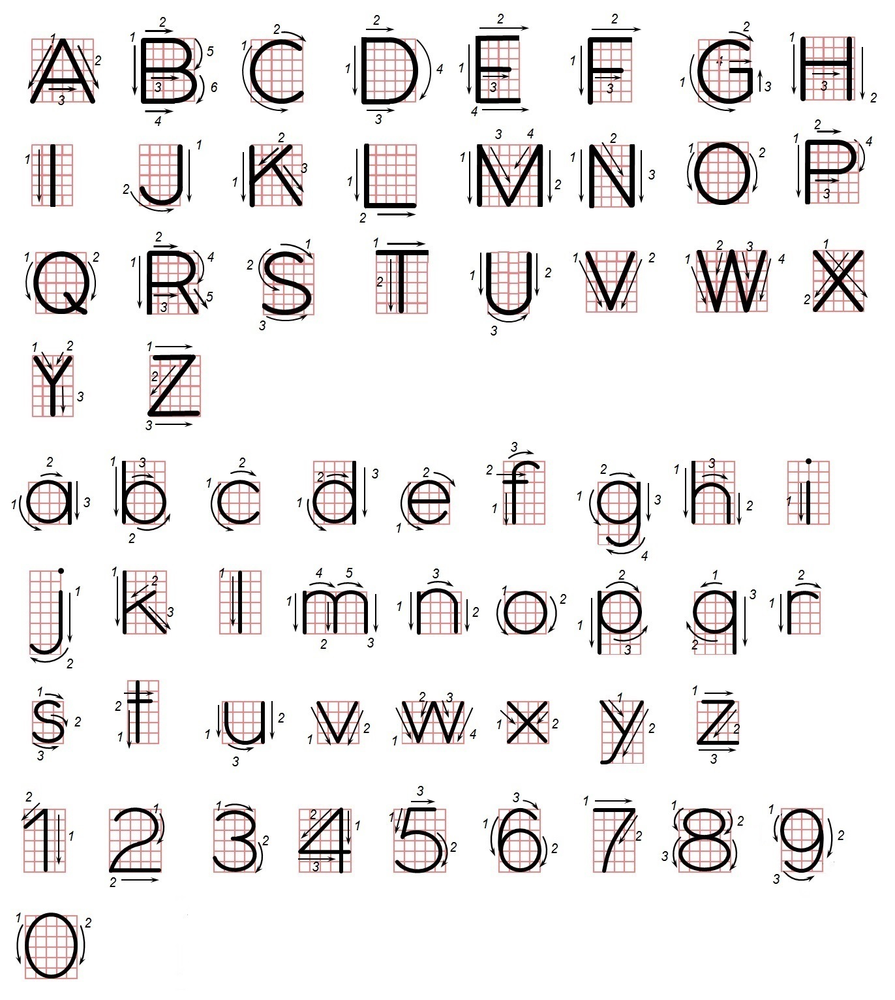
Fuente: https://es-static.z-dn.net/files/ddf/c6ad64c8ad3d4f91426e766008bd3208.jpg

<h3>Escalas</h3>

La escala es la relación entre el tamaño del objeto real y el tamaño del objeto dibujado, la cual se debe escribir en el rotulo del formato.

<ul>
    <li>Escala natural: El tamaño del objeto real y el tamaño del objeto dibujado son iguales (1:1)</li>
    <li>El tamaño del objeto real es muy grande y por tanto, el tamaño del objeto dibujado debe reducirse (ej: 1:2)</li>
    <li>Escala de ampliación: El tamaño del objeto real es muy pequeño y por tanto, el tamaño del objeto dibujado debe ampliarse (ej: 2:1)</li>
</ul>

𝐸𝑠𝑐𝑎𝑙𝑎=(𝑇𝑎𝑚𝑎ñ𝑜 𝑑𝑒𝑙 𝑜𝑏𝑗𝑒𝑡𝑜 𝑑𝑖𝑏𝑢𝑗𝑎𝑑𝑜)/(𝑇𝑎𝑚𝑎ñ𝑜 𝑑𝑒𝑙 𝑜𝑏𝑗𝑒𝑡𝑜 𝑟𝑒𝑎𝑙)

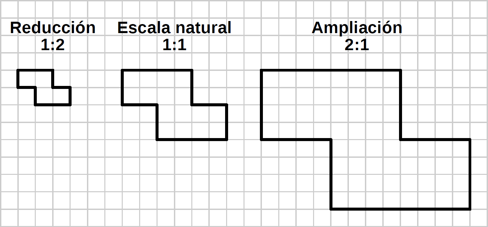
Fuente: https://www.picuino.com/es/_images/dibujo-escalas.png

<h2>Escalas normalizadas</h2>

