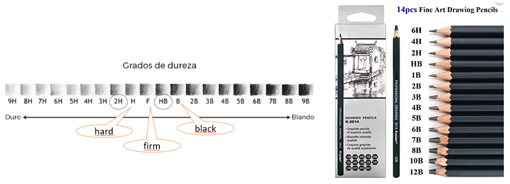
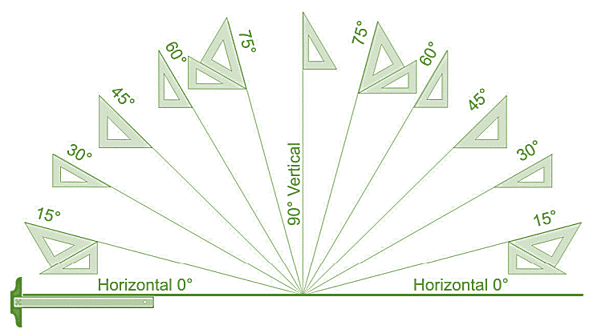
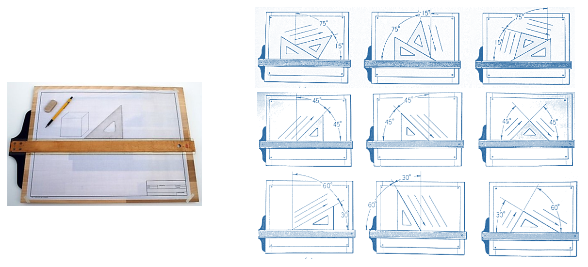
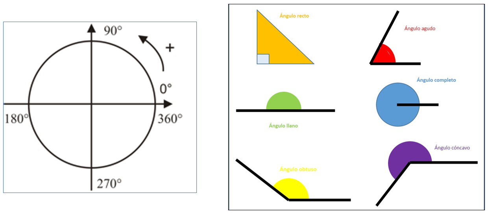
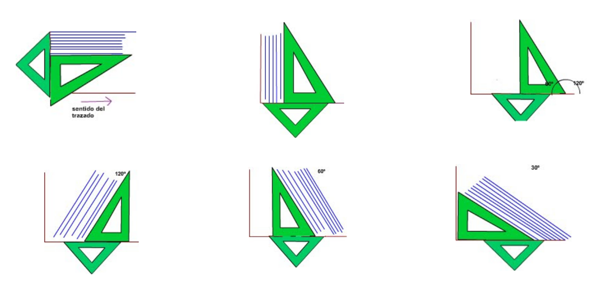
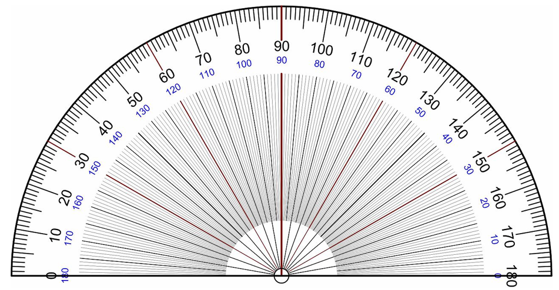

<h1>Aula 2</h1>

Esta clase consiste en aprender a utilizar los instrumentos y también a conocer los diferentes tipos de líneas y la construcción de figuras geométricas.

<h2>Manejo de instrumentos, líneas y construcción de figuras geométricas</h2>

<h3>Tipos de minas</h3>

Mina dura (H) “hard” : Los lápices de grafito que llevan una H son de rastro suave, de un gris claro a un gris medio. A mayor número, mayor dureza.  Van desde H hasta 9H

Los trazos realizados con estos lápices se pueden borrar fácilmente, se recomienda un trazo suave.

Mina Blanda (B) “Black”: Los lápices de grafito con la letra B tienen una mina más blanda. Pueden llegar a producir negros muy intensos. Normalmente sus graduaciones van desde el B al 9B.  

Se usa para crear todo tipo de sombras. Los trazos son difíciles de borrar, y la mina tiene un desgaste rápido

<h3>Instrumentos</h3>

<h3>Líneas</h3>

Las líneas son una sucesión de puntos entre dos extremos, con diferentes formas, así como: curvas, rectas horizontales y verticales, entre otras; las cuales sirven para asociar, unir, rodear, soportar o cortar superficies de objetos 2D y 3D.

Fuente: https://es-static.z-dn.net/files/da7/e66a2a18e443a7fcf09b21f4ca73791e.jpg

<h4>Líneas rectas</h4>

<h4>figuras geométricas</h4>

