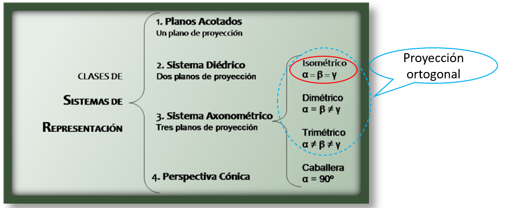
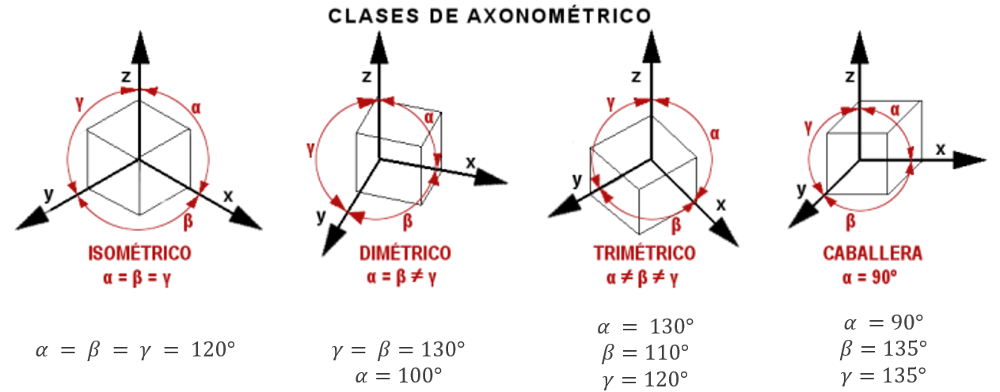
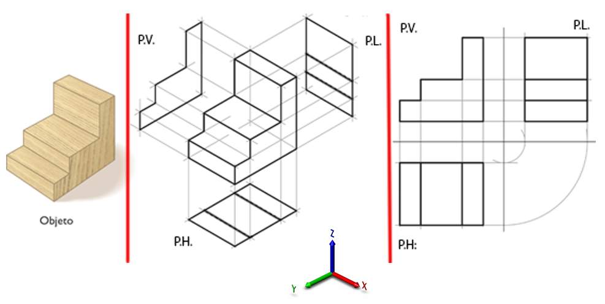
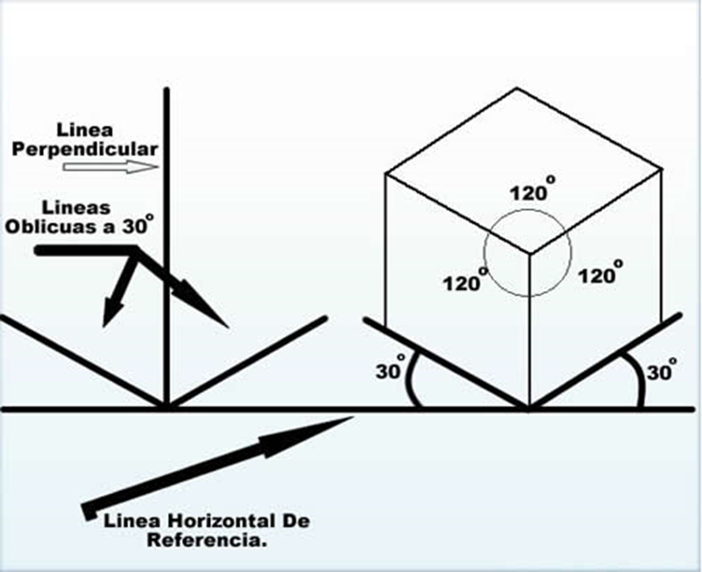
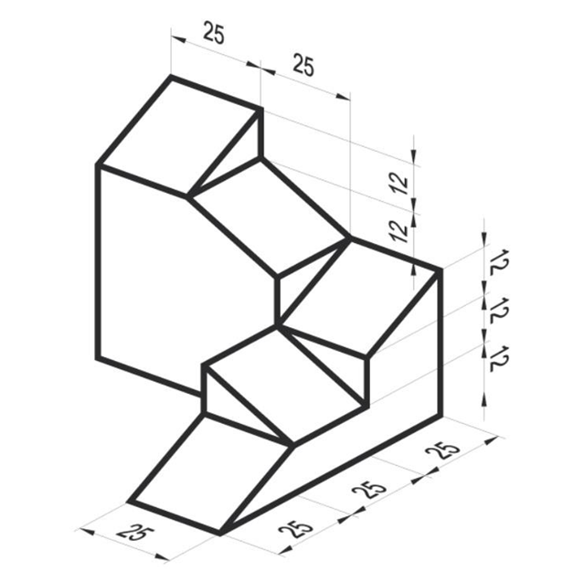

<h1>Aula 3</h1>

Esta clase consiste en comprender las diferentes representaciones gráficas y proyecciones en tres dimensiones de objetos

<h2>Representaciones gráficas</h2>

Las representaciones gráficas de objetos permite:

1. Representar un objeto (3 dimensiones) en un plano (2 dimensiones)
2. Representar un plano (2 dimensiones) en un objeto (3 )

<h3>Proyecciones</h3>

El sistema de representación axonométrica, a través de proyección ortogonal con diferentes perspectivas o proyecciones (ángulos).

<h4>Proyección ortogonal</h4>

La proyección ortogonal es la representación de un objeto en el espacio en tres planos diferentes X, Y y Z.

<h5>Proyección isométrica</h5>

La proyección isométrica es una representación axonométrica ortogonal de un objeto, teniendo en cuenta que la inclinación entre los tres ejes es de 120°; así mismo, con respecto a la horizontal, la inclinación de las líneas oblicuas es de 30°

<h3>Ejercicio 1</h3>

Dibujar el solido a escala 1:1 (dimensiones en mm) en una plancha formato A4 (vertical) con manejo de instrumentos con su respectivo rotulo en letra técnica

Fuente: Germán Vargas, presentación Manejo de instrumentos, 2019

<h3>Ejercicio 2</h3>

Dibujar el solido a escala 1:1 (dimensiones en mm) en una plancha formato A4 (vertical) con manejo de instrumentos con su respectivo rotulo en letra técnica.

Fuente: Germán Vargas, presentación Manejo de instrumentos, 2019