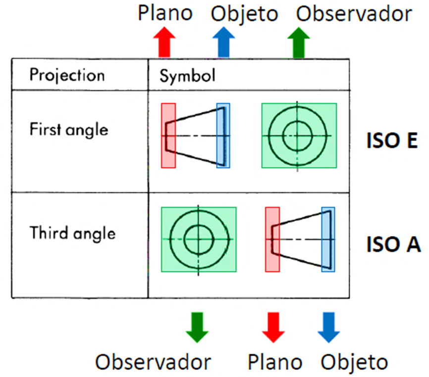

<h1>Aula 4</h1>

Esta clase consiste en analizar un objeto con proyección isométrica en las diferentes vistas teniendo en cuenta la normatividad ISO-A e ISO-E; así como el acotado en las diferentes vistas.

<h2>Vistas</h2>

Las vistas de un objeto 3D se obtienen a partir de la proyección sobre los diferentes planos, tales como alzado, lateral y planta.

<h3>Vistas (NTC 1777)</h3>

Las vistas de un objeto representan las diferentes perspectivas en 2D de dicho objeto.

- La vista de frente o principal debe ser  la vista que proporcione mayor información  sobre un objeto. Esta vista muestra la pieza en su posición de funcionamiento.

- Las piezas que se puede usar en cualquier posición se deberán dibujar, preferiblemente, en la posición principal de fabricación o montaje

<h3>ISO E</h3>

Proyección de Primer Ángulo (ISO E): Representación ortográfica donde el objeto por representar aparece entre el observador y  los planos visuales.

<h3>ISO A</h3>

Proyección de Tercer Ángulo (ISO A): Representación ortográfica en la que el objeto por representar y a ser visto por un observador aparece atrás de los planos visuales.

<h3>Vistas ISO E a Isométrico</h3>

Fuente: https://dibujafacil.com/como-dibujar/como-dibujar-en-perspectiva-isometrica-paso-a-paso/

<h2>Acotado (NTC 1960)</h2>

Acotar  es  el  proceso  de  anotar,  mediante  líneas,  cifras,  signos  y  símbolos,  las medidas de un objeto, siguiendo una serie de reglas y convencionalismos, establecidos mediante normas.

- Líneas de cota: Son líneas paralelas a la superficie del objeto de medición, sirven para indicar medidas, se colocan de manera  perpendicular a las aristas, o paralelamente a la dimensión a acotar
- Cifras de cota: Es un número que indica la magnitud
- Símbolo de final de cota: Las líneas de cota serán terminadas en sus extremos por un símbolo
- Líneas auxiliares de cota: Son líneas que parten  del dibujo de forma perpendicular a la superficie a acotar, y limitan la longitud de las líneas de cota. Deben sobresalir ligeramente de las líneas de cota

Los extremos de las líneas de cota se señalan con flechas cuya longitud es aproximadamente cinco veces la anchura de las aristas del cuerpo, es decir, si se dibujan las aristas visibles con líneas continuas de 0.5 milímetros, la longitud de la flecha será de 2.5 mm. La punta de la flecha forma un ángulo de 15º, aproximadamente.

Símbolos: A la cifra de cota le acompaña un símbolo indicativo de características formales de la pieza, que simplifican su acotación, y en ocasiones permiten reducir el número de vistas necesarias, para definir la pieza.

- Cotas funcionales (F): Son aquellas cotas esenciales, para que la pieza pueda cumplir su función

- Cotas no funcionales (NF): Son aquellas que sirven para la total definición de la pieza, pero no son esenciales para que la pieza cumpla su función.

- Cotas Auxiliar (AUX): Solo para propósitos de información, se deriva de otros valores mostrados sobre el dibujo

- Dimensionamiento de cadena: Se utilizara únicamente cuando la acumulación de tolerancias no afecte la funcionalidad de la pieza acotada.

- Dimensionamiento desde una característica común: Acotación a partir de un plano de referencia común

- Dimensionamiento combinado

- Dimensionamiento por coordenadas

- Característica repetida

- Dimensionamiento de biseles o chaflanes

Los números de cota de longitudes y ángulos, deben leerse desde abajo o desde la derecha cuando se mantiene el dibujo o plano en su posición de fabricación. Se evitará en lo posible acotar dentro del espacio de ángulo rayado de 30º y siempre encima de la línea de cota. 

<h3>Errores de acotado</h3>

<h3>Ejercicio 1</h3>

Dibujar las vistas (ISO A) del solido a escala 1:1 (dimensiones en mm) en una plancha formato A4 (vertical) con manejo de instrumentos con su respectivo rotulo en letra técnica.

Fuente: Germán Vargas, presentación Manejo de instrumentos, 2019

Dibujar el solido en proyección isométrica a escala 1:1 a partir de las vistas (ISO E) en una plancha formato A4 (vertical) con manejo de instrumentos con su respectivo rotulo en letra técnica.

