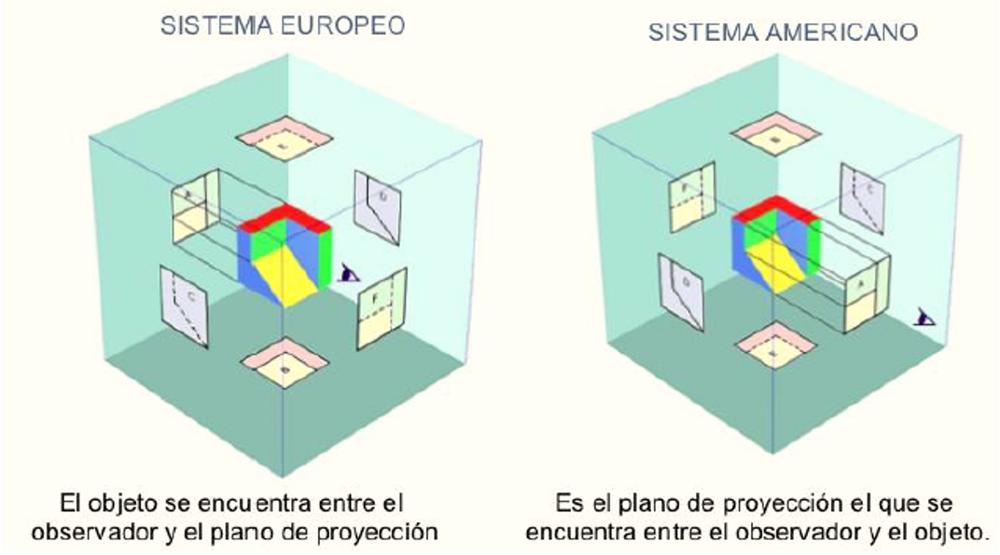

<h1>Aula 5</h1>

Esta clase consiste en analizar un objeto con proyección isométrica en las diferentes vistas teniendo en cuenta la normatividad ISO-A e ISO-E; así como el acotado en las diferentes vistas.

<h2>Vistas</h2>

Las vistas de un objeto 3D se obtienen a partir de la proyección sobre los diferentes planos, tales como alzado, lateral y planta.

<h3>Vistas (NTC 1777)</h3>

Las vistas de un objeto representan las diferentes perspectivas en 2D de dicho objeto.

- La vista de frente o principal debe ser  la vista que proporcione mayor información  sobre un objeto. Esta vista muestra la pieza en su posición de funcionamiento.

- Las piezas que se puede usar en cualquier posición se deberán dibujar, preferiblemente, en la posición principal de fabricación o montaje

<h3>ISO E</h3>

Proyección de Primer Ángulo (ISO E): Representación ortográfica donde el objeto por representar aparece entre el observador y  los planos visuales.

<h3>ISO A</h3>

Proyección de Tercer Ángulo (ISO A): Representación ortográfica en la que el objeto por representar y a ser visto por un observador aparece atrás de los planos visuales.

<h2>Acotado</h2>