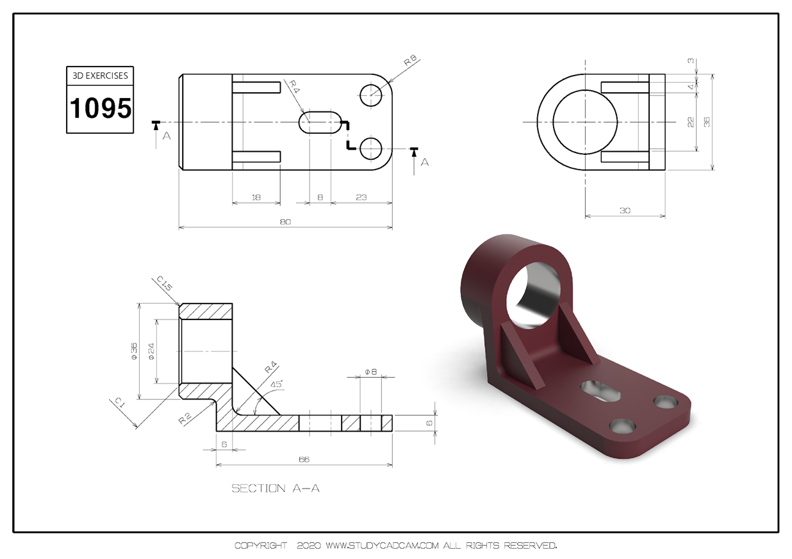

<h1>Aula 8</h1>

Esta clase consiste en diseñar piezas en SolidWorks teniendo en cuenta la proyección isométrica

<h2>Diseño de piezas en SolidWorks</h2>

Para diseñar una pieza en SolidWorks principalmente tener en cuenta los 3 planos de proyección sobre los cuales se podrán realizar bocetos, para crear o quitar volumen.

<h3>Ejercicio 1</h3>

<h3>Ejercicio 2</h3>

Fuente: https://studycadcam.blogspot.com/2021/07/3d-cad-exercises-1095.html