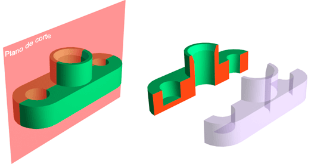
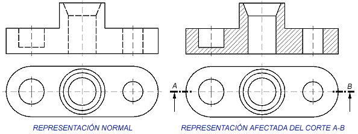
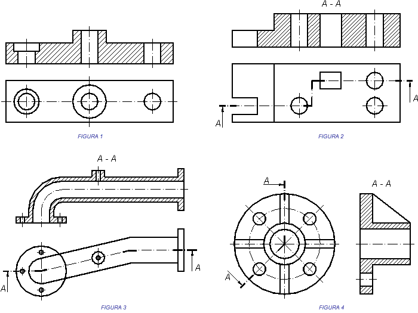
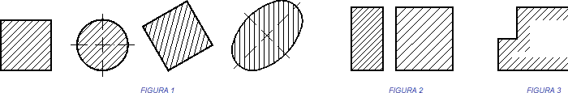
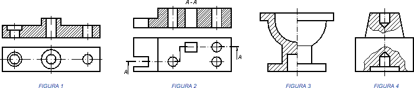

<h1>Aula 9</h1>

Esta clase consiste en obtener las vistas auxiliares y de corte SolidWorks

<h2>Vistas en SolidWorks</h2>

Las vistas brindan información relevante sobre diferentes caras de una pieza, así mismo, cuando una pieza es muy compleja en su interior, una vista de corte permite entender detalles del interior de dicha pieza que no son claros desde las partes externas la misma pieza.

Fuente: https://dibujotecnico.com/cortes-secciones-y-roturas/

La vista de corte se representa con un rayado (achurado)

Fuente: https://dibujotecnico.com/cortes-secciones-y-roturas/

<h3>Representación de un corte</h3>

La trayectoria de un corte sobre una vista se debe realizar a través de una línea de trazo y un punto fino y tramos gruesos al inicio y al fin. De igual manera, en los extremos se deben colocar letras simbólicas (A-A, B-B, A-B) del inicio y fin de la trayectoria, así como el sentido del corte es representado por flechas en el inicio y en el fin.

Un corte puede ser realizado a través de: a) un único plano, b) planos paralelos, c) planos sucesivos y d) planos concurrentes.

Fuente: https://dibujotecnico.com/cortes-secciones-y-roturas/

<h3>Rayado de los cortes</h3>

Las superficies de la vista de corte son resaltadas con un rayado (achurado) de líneas paralelas, cuya inclinación debe ser de 45° y una separación entre líneas entre 0.7 mm y 3 mm.

Fuente: https://dibujotecnico.com/cortes-secciones-y-roturas/

<h3>Tipos de corte</h3>

Los tipos de cortes pueden ser: a) corte total, b) semicorte o corte al cuarto y c) corte parcial o mordedura

Fuente: https://dibujotecnico.com/cortes-secciones-y-roturas/

<h3>Ejercicio 1</h3>

<h3>Ejercicio 2</h3>

Fuente: https://studycadcam.blogspot.com/2021/07/3d-cad-exercises-1095.html