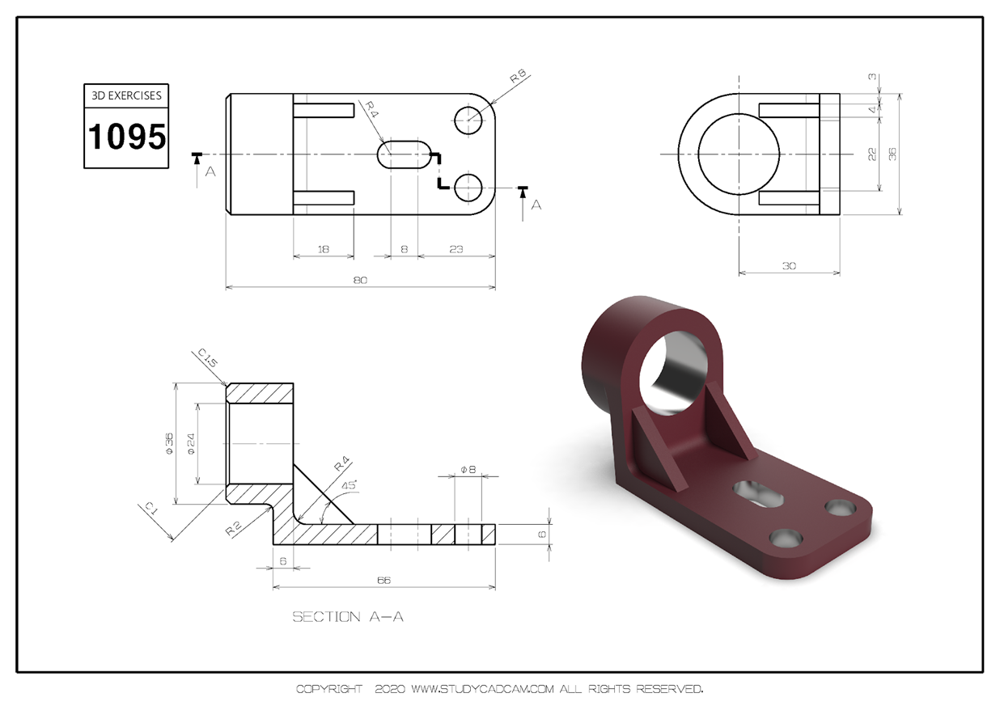

<h1>Aula 9</h1>

Esta clase consiste en obtener las vistas auxiliares y de corte SolidWorks

<h2>Vistas en SolidWorks</h2>

Las vistas brindan información relevante sobre diferentes caras de una pieza, así mismo, cuando una pieza es muy compleja en su interior, una vista de corte permite entender detalles del interior de dicha pieza que no son claros desde las partes externas la misma pieza.

Fuente: https://dibujotecnico.com/cortes-secciones-y-roturas/

Fuente: https://dibujotecnico.com/cortes-secciones-y-roturas/

<h3>Líneas de corte</h3>

Fuente: https://dibujotecnico.com/cortes-secciones-y-roturas/

<h3>Representación de un corte</h3>

Fuente: https://dibujotecnico.com/cortes-secciones-y-roturas/

<h3>Rayado de los cortes</h3>

Fuente: https://dibujotecnico.com/cortes-secciones-y-roturas/

<h3>Tipos de corte</h3>

Fuente: https://dibujotecnico.com/cortes-secciones-y-roturas/

<h3>Ejercicio 1</h3>

<h3>Ejercicio 2</h3>

Fuente: https://studycadcam.blogspot.com/2021/07/3d-cad-exercises-1095.html