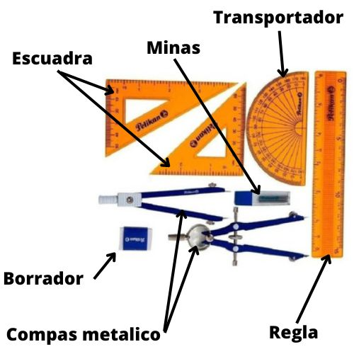
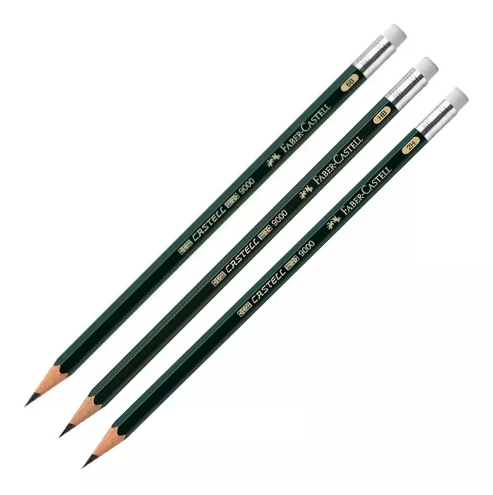
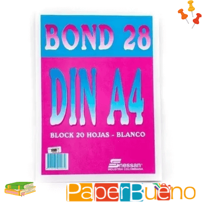

<h1 align="center">Profesor: MSc. Fabián Barrera Prieto 👨‍🏫 
Materia: Expresión gráfica ✏️📐 
Universidad: UMNG 🏫 
Año: 2026 📅</h1> 

Expresión gráfica está enfocada al diseño de planos en 3D a mano alzada y en software de diseño asistido por computador (CAD)

<h1>Aula 1</h1>

En esta clase se presenta la materia, en cuanto al contenido temático, los métodos de evaluación, las observaciones, las NO EXCUSAS y los recursos para el desarrollo del curso.

<h2>Presentación de la materia 🚀</h2>

<h3>TEMAS 🤓</h3>

<h4>Primer corte AMB A</h4>

<table>
	<tr>
		<td>Fecha</td> <td>Horas</td> <td>Clase</td> <td>Semana</td> <td>Actividades</td>
	</tr>
	<tr>
		<td>26/01/2026</td> <td>3</td> <td>1</td> <td>1</td> <td>Presentación de la materia e Introducción a expresión gráfica</td>
	</tr>
	<tr>
		<td>02/02/2026</td> <td>3</td> <td>2</td> <td>2</td> <td>Manejo de instrumentos, líneas y construcción de figuras geométricas</td>
	</tr>
	<tr>
		<td>09/02/2026</td> <td>3</td> <td>3</td> <td>3</td> <td>Representaciones gráficas de objetos y proyecciones</td>
	</tr>
	<tr>
		<td>16/02/2026</td> <td>3</td> <td>4</td> <td>4</td> <td>Vistas ISO A e ISO E y acotado</td>
	</tr>
	<tr>
		<td>23/02/2026</td> <td>3</td> <td>5</td> <td>5</td> <td>Parcial primer corte</td>
	</tr><!--semana de parciales del primer corte-->
	<tr>
		<td>02/03/2026</td> <td>3</td> <td>6</td> <td>6</td> <td>Retroalimentación del parcial primer corte Entrega de notas primer corte</td>
	</tr><!--última semana de registro de notas del primer corte-->
</table>

<h4>Segundo corte AMB A</h4>

<table>
	<tr>
		<td>Fecha</td> <td>Horas</td> <td>Clase</td> <td>Semana</td> <td>Actividades</td>
	</tr>
	<tr>
		<td>09/03/2026</td> <td>3</td> <td>7</td> <td>7</td> <td>Diseño de piezas SolidWorks</td>
	</tr>
	<tr>
		<td>16/03/2026</td> <td>3</td> <td>8</td> <td>8</td> <td>Vistas auxiliares y de corte SolidWorks</td>
	</tr>
	<tr>
		<td>23/03/2026</td> <td>3</td> <td>9</td> <td>9</td> <td>FESTIVO</td>
	</tr>
	<tr>
		<td>30/03/2026</td> <td></td> <td></td> <td></td> <td>SEMANA SANTA</td>
	</tr>
	<tr>
		<td>06/04/2026</td> <td>3</td> <td>10</td> <td>10</td> <td>Desarrollo de taller</td>
	</tr>
	<tr>
		<td>13/04/2026</td> <td>3</td> <td>11</td> <td>11</td> <td>Parcial segundo corte</td>
	</tr><!--semana de parciales del segundo corte-->
	<tr>
		<td>20/04/2026</td> <td>3</td> <td>12</td> <td>12</td> <td>Retroalimentación del parcial segundo corte Entrega de notas segundo corte</td>
	</tr><!--última semana de registro de notas del primer corte-->

</table>

<h4>Tercer corte AMB A</h4>

<table>
	<tr>
		<td>Fecha</td> <td>Horas</td> <td>Clase</td> <td>Semana</td> <td>Actividades</td>
	</tr>
	<tr>
		<td>27/04/2026</td> <td>3</td> <td>13</td> <td>13</td> <td>Ensamblaje de elementos y simulación SolidWorks Socialización de proyecto</td>
	</tr>
	<tr>
		<td>04/05/2026</td> <td>3</td> <td>14</td> <td>14</td> <td>Desarrollo de taller y proyecto</td>
	</tr>
	<tr>
		<td>11/05/2026</td> <td>3</td> <td>15</td> <td>15</td> <td>Desarrollo de taller y proyecto</td>
	</tr>
	<tr>
		<td>18/05/2026</td> <td>3</td> <td>16</td> <td>16</td> <td>FESTIVO</td>
	</tr><!--Finalización de clases-->
	<tr>
		<td>25/05/2026</td> <td>3</td> <td>17</td> <td>17</td> <td>Entregas de taller y proyecto Entrega de notas finales</td>
	</tr>
</table>

<h4>Primer corte AMB B</h4>

<table>
	<tr>
		<td>Fecha</td> <td>Horas</td> <td>Clase</td> <td>Semana</td> <td>Actividades</td>
	</tr>
	<tr>
		<td>30/01/2026</td> <td>3</td> <td>1</td> <td>1</td> <td>Presentación de la materia e Introducción a expresión gráfica</td>
	</tr>
	<tr>
		<td>06/02/2026</td> <td>3</td> <td>2</td> <td>2</td> <td>Manejo de instrumentos, líneas y construcción de figuras geométricas</td>
	</tr>
	<tr>
		<td>13/02/2026</td> <td>3</td> <td>3</td> <td>3</td> <td>Representaciones gráficas de objetos y proyecciones</td>
	</tr>
	<tr>
		<td>20/02/2026</td> <td>3</td> <td>4</td> <td>4</td> <td>Vistas ISO A e ISO E y acotado</td>
	</tr>
	<tr>
		<td>27/02/2026</td> <td>3</td> <td>5</td> <td>5</td> <td>Parcial primer corte</td>
	</tr><!--semana de parciales del primer corte-->
	<tr>
		<td>06/03/2026</td> <td>3</td> <td>6</td> <td>6</td> <td>Retroalimentación del parcial primer corte Entrega de notas primer corte</td>
	</tr><!--última semana de registro de notas del primer corte-->
</table>

<h4>Segundo corte AMB B</h4>

<table>
	<tr>
		<td>Fecha</td> <td>Horas</td> <td>Clase</td> <td>Semana</td> <td>Actividades</td>
	</tr>
	<tr>
		<td>13/03/2026</td> <td>3</td> <td>7</td> <td>7</td> <td>Diseño de piezas SolidWorks</td>
	</tr>
	<tr>
		<td>20/03/2026</td> <td>3</td> <td>8</td> <td>8</td> <td>Vistas auxiliares y de corte SolidWorks</td>
	</tr>
	<tr>
		<td>27/03/2026</td> <td>3</td> <td>9</td> <td>9</td> <td>Desarrollo de taller</td>
	</tr>
	<tr>
		<td>03/04/2026</td> <td></td> <td></td> <td></td> <td>SEMANA SANTA</td>
	</tr>
	<tr>
		<td>10/04/2026</td> <td>3</td> <td>10</td> <td>10</td> <td>Desarrollo de taller</td>
	</tr>
	<tr>
		<td>17/04/2026</td> <td>3</td> <td>13</td> <td>11</td> <td>Parcial segundo corte</td>
	</tr><!--semana de parciales del segundo corte-->
	<tr>
		<td>24/04/2026</td> <td>3</td> <td>13</td> <td>12</td> <td>Retroalimentación del parcial segundo corte Entrega de notas segundo corte</td>
	</tr><!--última semana de registro de notas del primer corte-->

</table>

<h4>Tercer corte AMB B</h4>

<table>
	<tr>
		<td>Fecha</td> <td>Horas</td> <td>Clase</td> <td>Semana</td> <td>Actividades</td>
	</tr>
	<tr>
		<td>01/05/2026</td> <td>3</td> <td>13</td> <td>13</td> <td>FESTIVO</td>
	</tr>
	<tr>
		<td>08/05/2026</td> <td>3</td> <td>14</td> <td>14</td> <td>Ensamblaje de elementos y simulación SolidWorks Socialización de proyecto</td>
	</tr>
	<tr>
		<td>15/05/2026</td> <td>3</td> <td>15</td> <td>15</td> <td>Desarrollo de taller y proyecto</td>
	</tr>
	<tr>
		<td>22/05/2026</td> <td>3</td> <td>16</td> <td>16</td> <td>Desarrollo de taller y proyecto</td>
	</tr><!--Finalización de clases-->
	<tr>
		<td>29/05/2026</td> <td>3</td> <td>17</td> <td>17</td> <td>Entregas de taller y proyecto Entrega de notas finales</td>
	</tr>
</table>

<h3>MÉTODOS DE EVALUACIÓN ✍️</h3>

<h4>AMB A</h4>

<table>
	<tr>
		<td>Corte</td> <td>Actividad</td> <td>Porcentaje 💯</td> <td>Fecha</td> <td>Metodología</td>
	</tr>
	<tr>
		<td rowspan="2">Primer (30%)</td> <td>Parcial</td> <td>12%</td> <td>23/02/2026</td> <td rowspan="7">Presencial</td>
	</tr>
	<tr>
		<td>Quices y/o talleres</td> <td>18%</td> <td>02/03/2026</td> 
	</tr>
	<tr>
		<td rowspan="2">Segundo (30%)</td> <td>Parcial</td> <td>12%</td> <td>13/04/2026</td>
	</tr>
	<tr>
		<td>Quices y/o talleres</td> <td>18%</td> <td>20/04/2026 </td>
	</tr>
	<tr>
		<td rowspan="3">Tercer (40%)</td> <td>Proyecto</td> <td>24%</td> <td>25/05/2026</td>
	</tr>
	<tr>
		<td>Quices y/o talleres</td> <td>16%</td> <td>25/05/2026</td>
	</tr>
</table>

<h4>AMB B</h4>

<table>
	<tr>
		<td>Corte</td> <td>Actividad</td> <td>Porcentaje 💯</td> <td>Fecha</td> <td>Metodología</td>
	</tr>
	<tr>
		<td rowspan="2">Primer (30%)</td> <td>Parcial</td> <td>12%</td> <td>27/02/2026</td> <td rowspan="7">Presencial</td>
	</tr>
	<tr>
		<td>Quices y/o talleres</td> <td>18%</td> <td>06/03/2026</td> 
	</tr>
	<tr>
		<td rowspan="2">Segundo (30%)</td> <td>Parcial</td> <td>12%</td> <td>17/04/2026</td>
	</tr>
	<tr>
		<td>Quices y/o talleres</td> <td>18%</td> <td>24/04/2026 </td>
	</tr>
	<tr>
		<td rowspan="3">Tercer (40%)</td> <td>Proyecto</td> <td>24%</td> <td>29/05/2026</td>
	</tr>
	<tr>
		<td>Quices y/o talleres</td> <td>16%</td> <td>29/05/2026</td>
	</tr>
</table>

Nota del curso = (0.3)*NotaCorte1 + (0.3)*NotaCorte2 + (0.4)*NotaCorte3

<h3>OBSERVACIONES ⚠️</h3>

<h4>Observaciones de clase</h4>
	<ul>
		<li> Inicio de clases: Quince (15) minutos después de la hora inicial definida de la clase y el control de asistencia se realiza a cada inicio de clase ⌚</li>
		<li> Fin de clases: Quince (15) minutos antes de la hora final definida de la clase ⏱️</li>
		<li> Respeto en clase 🤝</li>
		<li> No presto mi computador para presentar laboratorios, talleres y/o proyectos 🤦‍♂️</li>
		<li> Prohibido el uso de celular en quices, parciales y clase 📵</li>
		<li> Permitidas las salidas al baño 🚻 y a recibir llamadas 📲, en los quices y parciales se debe dejar el celular en el puesto para salir al baño</li>
		<li> Si no dejan dictar la clase, pasan al tablero a dar la clase o doy la clase por vista 😤</li>
		<li> No es permitido tomar fotos, ni videos en clase 📵. El material de clase está en el siguiente repositorio git: https://github.com/FBarreraP/ExpresionGrafica </li>
		<li> Los laboratorios, talleres y parciales serán ser realizados individualmente 🧍‍♂️</li>
		<li> Quien llegue tarde se adelanta en el tema visto hasta el momento 🏃‍♂️</li>
	</ul>

<h4>Observaciones de reglamento estudiantil</h4>
<ul>
	<li> Revisión sobre la calificación solamente dentro de los dias (3) establecidos en el reglamento estudiantil </li>
	<li> Con el 20% de las fallas se pierde la materia</li>
	<li> Las ausencias a clases donde se saque una calificación se debe presentar la excusa familiar o laboral en la dirección del programa</li>
</ul>

<h3>NO EXCUSAS ❌</h3>

<ul>
	<li> Hace 5 minutos funcionaba (tengo un video funcionando) 😒</li>
	<li> Mi compañero tiene todo y no ha llegado 😐</li>
	<li> Mírelo ya, porque deja de funcionar 🤨</li>
	<li> Tengo más materias 🙄</li>
	<li> Trabajo y estudio 😶</li>
	<li> Se dañó en el bus 🤔</li>
	<li> No lo toque, no lo mire, ni se acerque mucho porque se daña 🤨</li>
</ul>

<h3>RECURSOS 🛠️</h3>

<ul>
	<li> Computador 💻</li>
	<li> SolidWorks</li>
	<li> Escuadras de 45 y 60, regla y transportador</li>
	

	
	 
	<figcaption>Fuente: https://panafargo.com/producto/kit-geometrico-con-compas-y-transportador/</figcaption>
	

	<li> Lápiz 2H y HB</li>
	

	
	 
	<figcaption>Fuente: https://articulo.mercadolibre.com.co/MCO-595466499-lapiz-graduado-x-3-unds-6b-hb-2h-faber-castell-9000-_JM</figcaption>
	

	<li> Block DIN A4 sin rótulo</li>
	

	
	 
	<figcaption>Fuente: https://paperbueno.com/producto/unidad_plancha-oficio-papel-bond-1-8-sin-rotulo/</figcaption>
	

</ul>